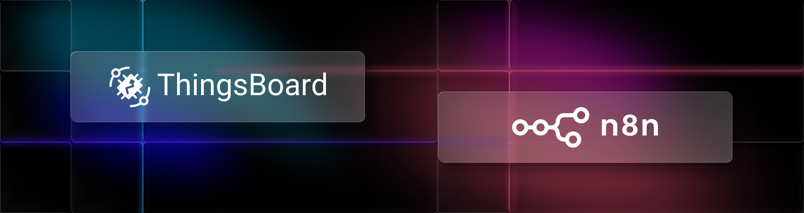

# ThingsBoard n8n Node



ThingsBoard is an open-source IoT platform for data collection, processing, visualization, and device management.

This community node for n8n enables you to seamlessly manage devices, assets, telemetry, dashboards, customers, relations, alarms, and entity groups directly within your n8n workflows — or use it as a Tool for AI Agents.

## 🚀 Quick Start

### Installation

```bash
npm install n8n-nodes-thingsboard
```

### Configuration

1. Get your ThingsBoard credentials (URL, username, password)
2. In n8n, add ThingsBoard credentials:
   - **Base URL**: `https://demo.thingsboard.io`, `https://thingsboard.cloud` or your instance URL
   - **Username**: Your ThingsBoard login
   - **Password**: Your ThingsBoard password
3. Add the ThingsBoard node to your workflow
4. Select a resource (Device, Asset, etc.) and operation

### Usage

The ThingsBoard node supports multiple usage patterns to fit your automation needs:

**🤖 AI Agent Tool** - Use as a tool for AI Agents to enable conversational IoT control
*Example*: "Show me all devices" → Agent calls ThingsBoard → Natural language response

**💡 Direct Operations** - Configure operations with fixed values in the node interface
*Example*: Save specific attributes to device `abc-123` on a schedule

**🔄 Dynamic Operations** - Pass data from previous nodes using expressions
*Example*: Process alarm webhook → Extract entity ID → Get attributes → Send notification

See [Usage Examples](#-usage-examples) below for detailed walkthroughs with screenshots.

**Operation Modes**: For create operations (Device, Asset, Dashboard), you can choose:
- **Params Mode**: Use simple form fields (name, type, label, customer ID)
- **JSON Mode**: Paste a complete ThingsBoard entity JSON object

## 📦 Installation Methods

### Method 1: GUI Installation (Recommended for Self-Hosted)

For self-hosted n8n instances, you can install directly via the web interface:

1. Open n8n in your browser
2. Navigate to **Settings** → **Community Nodes**
3. Click **Install a community node**
4. Enter package name: `n8n-nodes-thingsboard`
5. Click **Install**
6. Wait for installation to complete
7. Refresh your browser

**Note**: This method requires owner/admin permissions and is only available for self-hosted n8n (not n8n Cloud).

### Method 2: Manual Installation (npm)

For local n8n installations, install the node via npm:

```bash
# Create and navigate to the nodes directory
mkdir -p ~/.n8n/nodes
cd ~/.n8n/nodes

# Install the ThingsBoard node
npm install n8n-nodes-thingsboard
```

After installation, restart n8n:

```bash
# If running n8n directly
n8n start
```

**AI Agent Tool Usage**: If you plan to use the ThingsBoard node as a tool for AI Agents, set these environment variables before starting n8n:

```bash
export N8N_COMMUNITY_PACKAGES_ENABLED=true
export N8N_COMMUNITY_PACKAGES_ALLOW_TOOL_USAGE=true
n8n start
```

### Method 3: Docker Installation

Create a `Dockerfile`:

```dockerfile
FROM n8nio/n8n:latest
USER node
RUN cd /home/node/.n8n && \
    mkdir -p nodes && \
    cd nodes && \
    npm install n8n-nodes-thingsboard
```

Create or modify your `docker-compose.yml`:

```yaml
version: "3.8"

services:
  n8n:
    build: .
    ports:
      - "5678:5678"
    environment:
      - N8N_BASIC_AUTH_ACTIVE=true
      - N8N_BASIC_AUTH_USER=admin
      - N8N_BASIC_AUTH_PASSWORD=password
    volumes:
      - n8n_data:/home/node/.n8n

volumes:
  n8n_data:
```

Build and start the services:

```bash
docker-compose up -d --build
```

**AI Agent Tool Usage**: If you plan to use the ThingsBoard node as a tool for AI Agents, add these environment variables to your `docker-compose.yml`:

```yaml
environment:
  - N8N_COMMUNITY_PACKAGES_ENABLED=true
  - N8N_COMMUNITY_PACKAGES_ALLOW_TOOL_USAGE=true
```

### n8n Cloud

The ThingsBoard node requires verification to be available on n8n Cloud. n8n Cloud supports a select group of verified community nodes included in their official catalog.

**Current Status**: Until the node is verified and included in the Cloud-available catalog, use self-hosted n8n (local or Docker) with any installation method above.

## 🔧 Verify Installation

After installation and restart:

1. Open n8n in your browser (typically `http://localhost:5678`)
2. Create a new workflow
3. Click the **+** button to add a node
4. Search for **"ThingsBoard"** in the node picker
5. The **ThingsBoard** node should appear in the search results

If you don't see the node:
- Verify the npm installation completed without errors
- Ensure you restarted n8n after installation (for Method 2)
- Check n8n logs for any loading errors

## 🔑 Setting Up Credentials

Before using the ThingsBoard node, configure your connection credentials:

1. In n8n, navigate to **Credentials** → **New Credential**
2. Search for **"ThingsBoard API"**
3. Fill in the required fields:

| Field | Description | Example |
|-------|-------------|---------|
| **Base URL** | ThingsBoard instance URL (without trailing slash) | `https://demo.thingsboard.io` or `https://thingsboard.cloud` |
| **Username** | Your ThingsBoard account username/email | `tenant@thingsboard.org` |
| **Password** | Your ThingsBoard account password | `tenant` |

4. Click **Save** to store the credentials

The credentials are encrypted and stored securely by n8n. You can reuse the same credentials across multiple ThingsBoard nodes in different workflows.

## 📋 Supported Operations

### Device (8 operations)
- ✅ Create Device (Params/JSON mode)
- ✅ Delete Device
- ✅ Get Device by ID
- ✅ Get Device by Name
- ✅ Get Tenant Devices
- ✅ Get Customer Devices
- ✅ Get Devices by Entity Group (PE only)
- ✅ Get User Devices (PE only)

### Asset (7 operations)
- ✅ Create Asset (Params/JSON mode)
- ✅ Delete Asset
- ✅ Get Asset by ID
- ✅ Get Asset by Name
- ✅ Get Tenant Assets
- ✅ Get Customer Assets
- ✅ Get Assets by Entity Group (PE only)
- ✅ Get User Assets (PE only)

### Customer (7 operations)
- ✅ Create Customer (Params/JSON mode)
- ✅ Delete Customer
- ✅ Get Customer by ID
- ✅ Get Customer by Title
- ✅ Get Customers
- ✅ Get Customers by Entity Group (PE only)
- ✅ Get User Customers (PE only)

### Dashboard (5 operations)
- ✅ Create Dashboard (JSON mode)
- ✅ Delete Dashboard
- ✅ Get Dashboard by ID
- ✅ Get Dashboards
- ✅ Get Customer Dashboards

### Telemetry (14 operations)
- ✅ Get Attributes
- ✅ Get Attribute Keys
- ✅ Get Attribute Keys (by Scope)
- ✅ Get Latest Timeseries
- ✅ Get Timeseries (Time Range)
- ✅ Get Timeseries Keys
- ✅ Save Entity Attributes
- ✅ Save Device Attributes
- ✅ Save Entity Telemetry
- ✅ Save Entity Telemetry with TTL
- ✅ Delete Entity Attributes
- ✅ Delete Device Attributes
- ✅ Delete Entity Timeseries

### Alarm (6 operations)
- ✅ Get All Alarms
- ✅ Get Alarm by ID
- ✅ Get Alarm Info by ID
- ✅ Get Alarms by Originator
- ✅ Get Highest Severity Alarm
- ✅ Get Alarm Types

### Relation (7 operations)
- ✅ Get Relation
- ✅ Find by From
- ✅ Find by From with Relation Type
- ✅ Find by To
- ✅ Find by To with Relation Type
- ✅ Find Info by From
- ✅ Find Info by To

### Entity Group (5 operations - PE only)
- ✅ Get Entity Group by ID
- ✅ Get Entity Groups by Type
- ✅ Get Entity Groups by Owner and Type
- ✅ Get Entity Group by Owner/Name/Type
- ✅ Get Entity Groups for Entity

**Total: 61 operations across 8 resources**

## 🛠️ Development

### Quick Start

```bash
# Clone the repository
git clone https://github.com/thingsboard/thingsboard-n8n-node.git
cd thingsboard-n8n-node

# Install dependencies
npm install

# Build the project
npm run build

# Run in development mode (watch)
npm run dev
```

### Testing Locally

```bash
# Link the package
npm link

# In your n8n directory
npm link n8n-nodes-thingsboard

# Start n8n
n8n start
```

### Common Integration Patterns

#### Pattern 1: IoT Data Pipeline
```
Webhook → ThingsBoard (Save Telemetry) → Process Data → Save Attributes
```
Receive sensor data via webhook, save to ThingsBoard, process it, and update device attributes.

#### Pattern 2: Device Management
```
Schedule Trigger → Get Tenant Devices → Filter Inactive → Send Alert
```
Daily check for inactive devices and send notifications to administrators.

#### Pattern 3: Data Export
```
ThingsBoard (Get Timeseries) → Transform Data → Google Sheets / Database
```
Export telemetry data for reporting and analysis in external systems.

#### Pattern 4: Intelligent Monitoring
```
AI Agent ← Chat Interface
    ↓
ThingsBoard Tools (Get/Save/Delete operations)
    ↓
Automated device management based on natural language commands
```
Enable non-technical users to manage IoT infrastructure through conversational AI.

## 💡 Usage Examples

### 1. 🤖 AI Agent Tool - Conversational IoT Control

Use the ThingsBoard node as a **tool for AI Agents** to enable intelligent, natural language IoT automation.


**How it works**:
1. User sends a chat message: *"What devices do I have and what's their status?"*
2. AI Agent (powered by Google Gemini or OpenAI GPT-4) has access to ThingsBoard tools
3. Agent autonomously calls:
   - `Get devices in ThingsBoard` → Retrieves device list
   - `Get timeseries in ThingsBoard` → Fetches latest telemetry
4. Agent responds in natural language with the actual data

**Natural language commands**:
- *"Show me the temperature of my living room sensor"*
- *"Which devices are offline right now?"*
- *"Update the threshold on device X to 30 degrees"*
- *"Send me an alert if any temperature exceeds 25°C"*

The AI agent understands context and calls the appropriate ThingsBoard operations automatically!

**Workflow Configuration**:
1. **Chat Trigger** - Accept user queries
2. **AI Agent Node** - Process natural language queries
   - Model: OpenAI GPT-4, Google Gemini, or similar
   - Tools: ThingsBoard node (all operations available)
3. **Output Node** - Return AI response

---

### 2. 💡 Direct Operations - Fixed Values

Configure operations with **hardcoded values** directly in the node interface. Perfect for scheduled tasks and testing.


**Example**: Save configuration attributes to a specific device

**Configuration**:
- **Resource**: Telemetry
- **Operation**: Save Entity Attributes
- **Entity Type**: DEVICE
- **Entity ID**: `2d2c8cc0-d75a-11f0-9e9b-db8ef79a21ad` *(hardcoded)*
- **Scope**: SERVER_SCOPE
- **Attributes JSON**: Direct JSON input

```json
{
  "stringKey": "value1",
  "booleanKey": true,
  "doubleKey": 42.0,
  "longKey": 73,
  "jsonKey": {
    "someNumber": 42,
    "someArray": [1, 2, 3],
    "someNestedObject": {"key": "value"}
  }
}
```

**Typical Use Cases**:
- Daily configuration updates on a schedule
- Testing API operations during development
- One-time bulk data migrations
- Periodic attribute updates with fixed values

---

### 3. 🔄 Dynamic Operations - Flow-Based Automation

Pass data from previous nodes using **expressions** to create dynamic, data-driven workflows.


**Use Case**: Process ThingsBoard alarm webhook and fetch device attributes

**Workflow Steps**:

1. **Execute Workflow Trigger** - Start workflow with manual JSON input:
   ```json
   {
     "deviceName": "Refrigerator"
   }
   ```

2. **ThingsBoard Node** - Get a device by name
   - **Resource**: Device
   - **Operation**: Get by Name
   - **Device Name**: `{{ $json.deviceName }}` *(dynamically references "Refrigerator" from trigger)*

3. **ThingsBoard Node** - Timeseries keys
   - **Entity ID**: `{{ $json.id.id }}` *(extracts device ID from previous node)*
   - **Entity Type**: `{{ $json.id.entityType }}` *(extracts "DEVICE" from previous node)*

4. **ThingsBoard Node** - Get timeseries
   - **Entity ID**: `{{ $('Get a device by name').item.json.id.id }}` *(device ID from step 2)*
   - **Entity Type**: `{{ $('Get a device by name').item.json.id.entityType }}` *(type from step 2)*
   - **Keys**: `{{ $json.keys.join(',') }}` *(all keys from step 3)*
   - **Start Time**: Custom timestamp (e.g., last 7 days)
   - **End Time**: Current timestamp

**Note**: This example uses Execute Workflow trigger for simplicity, but you can choose different trigger types to execute your workflow (Schedule, Webhook, Manual, HTTP Request, etc.) depending on your automation needs.

**Common Dynamic Patterns**:
- Processing ThingsBoard webhooks and rule engine outputs
- Dynamic device operations based on alarm triggers
- Building complex IoT automation pipelines with data flow
- Integrating with external systems (Slack, email, databases, CRM)

## 📚 API Reference

The ThingsBoard n8n node is built on top of the ThingsBoard REST API. For detailed information about API endpoints, request/response formats, and additional parameters, refer to the [ThingsBoard REST API documentation](https://thingsboard.io/docs/reference/rest-api/).

## 🔗 Links

- **npm Package**: [n8n-nodes-thingsboard](https://www.npmjs.com/package/n8n-nodes-thingsboard)
- **GitHub Repository**: [thingsboard/thingsboard-n8n-node](https://github.com/thingsboard/thingsboard-n8n-node)
- **n8n Documentation**: [docs.n8n.io](https://docs.n8n.io/)
- **n8n Community**: [community.n8n.io](https://community.n8n.io/)
- **ThingsBoard REST API**: [REST API Reference](https://thingsboard.io/docs/reference/rest-api/)

## 🫶 Support

If you encounter issues or have questions about the ThingsBoard n8n node:

- **GitHub Issues**: [Report bugs or request features](https://github.com/thingsboard/thingsboard-n8n-node/issues)
- **ThingsBoard Community**: [Get help from the community](https://thingsboard.io/community/)
- **n8n Community**: [n8n community](https://community.n8n.io/)

## 📄 License

MIT License - see the [LICENSE file](https://github.com/thingsboard/thingsboard-n8n-node/blob/master/LICENSE.md) for details.

---

[n8n](https://n8n.io/) is a [fair-code licensed](https://docs.n8n.io/reference/license/) workflow automation platform.
