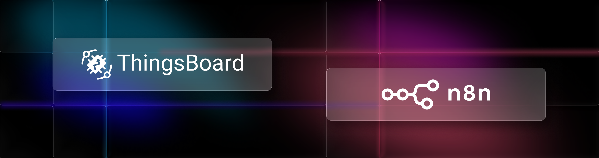
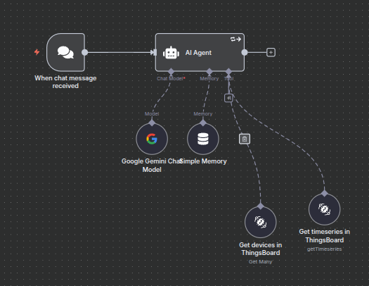
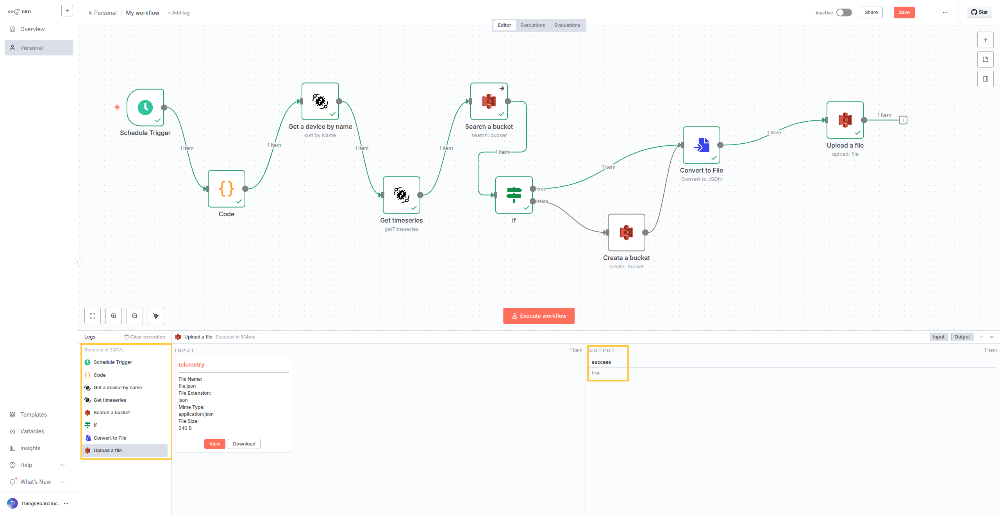
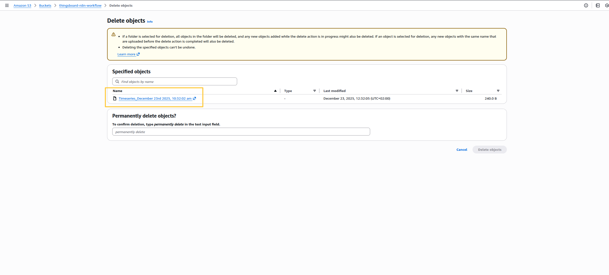

# ThingsBoard n8n Node



[n8n](https://n8n.io/) is a workflow automation platform that combines traditional business process automation with AI capabilities.

The **ThingsBoard n8n Node** provides deep and native integration between n8n and the ThingsBoard IoT Platform, enabling you to manage IoT infrastructure directly from n8n workflows.

## ✨ Features

- **Manage IoT devices, assets, and customers** directly from n8n workflows
- **Access and manipulate telemetry data** in real-time with attribute and time-series operations
- **Monitor alarms** and create automated responses based on alarm severity and type
- **Navigate entity relationships** to understand your IoT infrastructure topology
- **Build AI-powered IoT automation** using n8n AI Agents with natural language commands
- **Automate complex IoT workflows** with 61 operations across 8 resources (51 operations for Community Edition)

## 📖 Documentation

For detailed documentation including usage examples, workflow patterns, and API reference, visit:

**[ThingsBoard n8n Node Documentation](https://thingsboard.io/docs/samples/analytics/n8n-node/)**

## 🚀 Quick Start

### Installation

```bash
npm install @thingsboard/n8n-nodes-thingsboard
```

### Configuration

1. In n8n, add ThingsBoard credentials:
   - **Base URL**: `https://demo.thingsboard.io`, `https://thingsboard.cloud` or your instance URL
   - **Authentication Type**: Choose **API Key** (recommended) or **Username / Password**
   - **API Key**: Your ThingsBoard API key (see [API Key documentation](https://thingsboard.io/docs/user-guide/security/api-keys/))
2. Add the ThingsBoard node to your workflow
3. Select a resource (Device, Asset, etc.) and operation


## 📦 Installation

### GUI Installation

For self-hosted n8n instances, you can install directly via the web interface:

1. Open n8n in your browser
2. Navigate to **Settings** → **Community Nodes**
3. Click **Install a community node**
4. Enter package name: `@thingsboard/n8n-nodes-thingsboard`
5. Click **Install**
6. Wait for installation to complete
7. Refresh your browser

**Note**: This method requires owner/admin permissions.

### n8n Cloud

The ThingsBoard node is verified and available on n8n Cloud.

## 🔧 Verify Installation

After installation and restart:

1. Open n8n in your browser (typically `http://localhost:5678`)
2. Create a new workflow
3. Click the **+** button to add a node
4. Search for **"ThingsBoard"** in the node picker
5. The **ThingsBoard** node should appear in the search results

If you don't see the node:
- Verify the npm installation completed without errors
- Ensure you restarted n8n after installation (for Method 2)
- Check n8n logs for any loading errors

## 🔑 Setting Up Credentials

Before using the ThingsBoard node, configure your connection credentials:

1. In n8n, navigate to **Credentials** → **New Credential**
2. Search for **"ThingsBoard API"**
3. Fill in the required fields:

#### Option A: API Key (recommended)

| Field | Description | Example |
|-------|-------------|---------|
| **Base URL** | ThingsBoard instance URL | `https://demo.thingsboard.io` or `https://thingsboard.cloud` |
| **Authentication Type** | Select **API Key** | |
| **API Key** | Your ThingsBoard API key | `your-api-key-here` |

To create an API key, go to your ThingsBoard instance → **API Keys** and generate a new key. See the [API Key documentation](https://thingsboard.io/docs/user-guide/security/api-keys/) for details.

#### Option B: Username / Password

| Field | Description | Example |
|-------|-------------|---------|
| **Base URL** | ThingsBoard instance URL | `https://demo.thingsboard.io` or `https://thingsboard.cloud` |
| **Authentication Type** | Select **Username / Password** | |
| **Username** | Your ThingsBoard account email | `tenant@thingsboard.org` |
| **Password** | Your ThingsBoard account password | `tenant` |

4. Click **Save** to store the credentials

The credentials are encrypted and stored securely by n8n. You can reuse the same credentials across multiple ThingsBoard nodes in different workflows.

## 📋 Supported Operations

### Device (8 operations)
- ✅ Create Device (Params/JSON mode)
- ✅ Delete Device
- ✅ Get Device by ID
- ✅ Get Device by Name
- ✅ Get Tenant Devices
- ✅ Get Customer Devices
- ✅ Get Devices by Entity Group (PE only)
- ✅ Get User Devices (PE only)

### Asset (7 operations)
- ✅ Create Asset (Params/JSON mode)
- ✅ Delete Asset
- ✅ Get Asset by ID
- ✅ Get Asset by Name
- ✅ Get Tenant Assets
- ✅ Get Customer Assets
- ✅ Get Assets by Entity Group (PE only)
- ✅ Get User Assets (PE only)

### Customer (7 operations)
- ✅ Create Customer (Params/JSON mode)
- ✅ Delete Customer
- ✅ Get Customer by ID
- ✅ Get Customer by Title
- ✅ Get Customers
- ✅ Get Customers by Entity Group (PE only)
- ✅ Get User Customers (PE only)

### Dashboard (5 operations)
- ✅ Create Dashboard (JSON mode)
- ✅ Delete Dashboard
- ✅ Get Dashboard by ID
- ✅ Get Dashboards
- ✅ Get Customer Dashboards

### Telemetry (14 operations)
- ✅ Get Attributes
- ✅ Get Attribute Keys
- ✅ Get Attribute Keys (by Scope)
- ✅ Get Latest Timeseries
- ✅ Get Timeseries (Time Range)
- ✅ Get Timeseries Keys
- ✅ Save Entity Attributes
- ✅ Save Device Attributes
- ✅ Save Entity Telemetry
- ✅ Save Entity Telemetry with TTL
- ✅ Delete Entity Attributes
- ✅ Delete Device Attributes
- ✅ Delete Entity Timeseries

### Alarm (6 operations)
- ✅ Get All Alarms
- ✅ Get Alarm by ID
- ✅ Get Alarm Info by ID
- ✅ Get Alarms by Originator
- ✅ Get Highest Severity Alarm
- ✅ Get Alarm Types

### Relation (7 operations)
- ✅ Get Relation
- ✅ Find by From
- ✅ Find by From with Relation Type
- ✅ Find by To
- ✅ Find by To with Relation Type
- ✅ Find Info by From
- ✅ Find Info by To

### Entity Group (5 operations - PE only)
- ✅ Get Entity Group by ID
- ✅ Get Entity Groups by Type
- ✅ Get Entity Groups by Owner and Type
- ✅ Get Entity Group by Owner/Name/Type
- ✅ Get Entity Groups for Entity

**Total: 61 operations across 8 resources**

## 🛠️ Development

### Quick Start

```bash
# Clone the repository
git clone https://github.com/thingsboard/thingsboard-n8n-node.git
cd thingsboard-n8n-node

# Install dependencies
npm install

# Build the project
npm run build

# Run in development mode (watch)
npm run dev
```

### Testing Locally

```bash
# Link the package
npm link

# In your n8n directory
npm link @thingsboard/n8n-nodes-thingsboard

# Start n8n
n8n start
```

## 💡 Usage Examples

### Example 1: 🤖 AI Agent Tool - Conversational IoT Control

Use the ThingsBoard node as a **tool for AI Agents** to enable intelligent, natural language IoT automation.



#### How it works

1. User sends a chat message: *"What devices do I have and what's their status?"*
2. AI Agent (powered by Google Gemini or OpenAI GPT-4) has access to ThingsBoard tools
3. Agent autonomously calls:
   - `Get devices in ThingsBoard` → Retrieves device list
   - `Get timeseries in ThingsBoard` → Fetches latest telemetry
4. Agent responds in natural language with the actual data

#### Natural language commands

- *"Show me the temperature of my living room sensor"*
- *"Which devices are offline right now?"*
- *"Update the threshold on device X to 30 degrees"*
- *"Send me an alert if any temperature exceeds 25°C"*

The AI agent understands context and calls the appropriate ThingsBoard operations automatically!

---

### Example 2: 💡 Daily Telemetry Export to AWS S3

**Real-world scenario**: Every night, export device telemetry to S3, but also enrich it with device metadata from your CRM, convert to Parquet format for Athena, and trigger a Lambda function to update your data warehouse. One workflow, multiple outputs.

**Why use n8n instead of ThingsBoard's native export**:
- **Multi-destination** - Send the same data to S3 + Snowflake + email report in one workflow
- **Data transformation** - Enrich telemetry with business context (customer names, locations from CRM)
- **Custom formats** - Convert to Parquet, Avro, or CSV with specific schemas for your analytics tools
- **Conditional logic** - Export only specific devices, filter by customer tier, or aggregate before storage
- **Integration chains** - After S3 upload → Trigger AWS Lambda → Update tracking database → Send Slack notification




For a complete step-by-step guide with detailed screenshots, see the [full documentation](https://thingsboard.io/docs/samples/analytics/n8n-node/).

## 📚 API Reference

The ThingsBoard n8n node is built on top of the ThingsBoard REST API. For detailed information about API endpoints, request/response formats, and additional parameters, refer to the [ThingsBoard REST API documentation](https://thingsboard.io/docs/reference/rest-api/).

## 🔗 Links

- **npm Package**: [@thingsboard/n8n-nodes-thingsboard](https://www.npmjs.com/package/@thingsboard/n8n-nodes-thingsboard)
- **GitHub Repository**: [thingsboard/thingsboard-n8n-node](https://github.com/thingsboard/thingsboard-n8n-node)
- **n8n Documentation**: [docs.n8n.io](https://docs.n8n.io/)
- **n8n Community**: [community.n8n.io](https://community.n8n.io/)
- **ThingsBoard REST API**: [REST API Reference](https://thingsboard.io/docs/reference/rest-api/)

## 🫶 Support

If you encounter issues or have questions about the ThingsBoard n8n node:

- **GitHub Issues**: [Report bugs or request features](https://github.com/thingsboard/thingsboard-n8n-node/issues)
- **ThingsBoard Community**: [Get help from the community](https://thingsboard.io/community/)
- **n8n Community**: [n8n community](https://community.n8n.io/)

## 📄 License

MIT License - see the [LICENSE file](https://github.com/thingsboard/thingsboard-n8n-node/blob/master/LICENSE.md) for details.

---

[n8n](https://n8n.io/) is a [fair-code licensed](https://docs.n8n.io/reference/license/) workflow automation platform.
